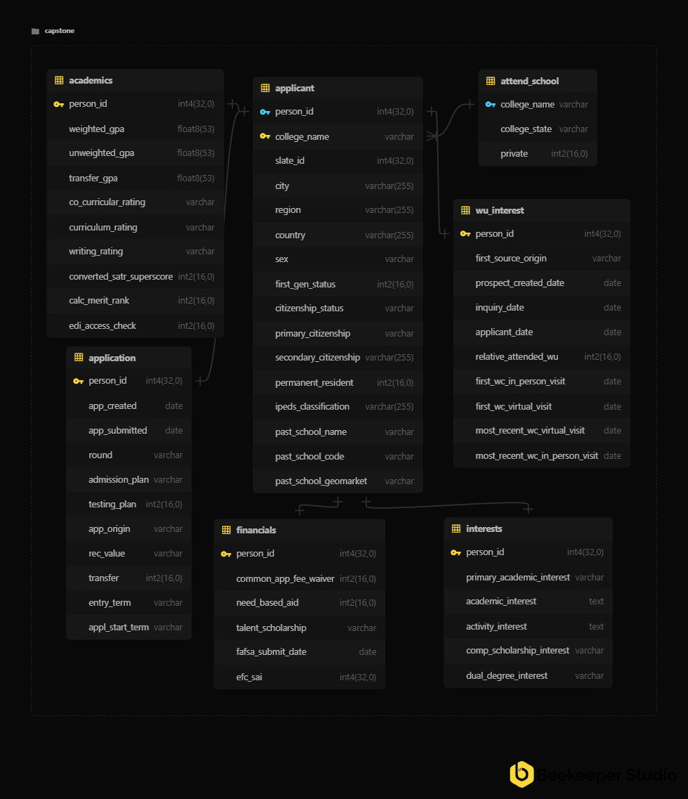

## Data Sources

We combined three years (2023–2025) of Willamette applicant records with
national enrollment records for students who were admitted but chose not to
attend Willamette.

| Dataset | Source | What it tells us |
|---------|--------|------------------|
| Applicant records | Willamette's Slate CRM | Everything about the application itself (academics, financials, campus engagement, demographics) |
| Enrollment destination | National Student Clearinghouse (NSC) | Where an admitted student who didn't come to Willamette actually enrolled instead |
| Institution classification | Carnegie Classification of Institutions of Higher Education | Used to sort each destination school into a size category for original research question |

Altogether, this covers about 9,400 applicants and roughly 6,500 confirmed
non-Willamette enrollment outcomes after the two sources were matched
together using an applicant's unique ID.

## How the Pieces Fit Together

The diagram below shows how the raw files became a single, analysis-ready
dataset.

## How the Underlying Data Is Organized for EDA

For anyone curious about the technical structure, the diagram below is the
entity-relationship diagram (ERD) for the cleaned staging database. Each
applicant's information is split across related tables: academics,
financials, interests, campus engagement, and application details.

## Ethics and Privacy

Protecting student privacy was a top priority throughout this project:

- **No personally identifiable information (PII)**, such as names, birthdates,
  or contact information was ever included in the data used for analysis.
  Early on, we noticed that birthdate, sex, and gender together could
  potentially be used to re-identify a student even without a name attached,
  so those fields were removed before the data ever reached our project.
- **Restricted access.** Only the two team members could access
  the source data, by connection to the Willamette campus network, using a combination of a raw password, a public/private key pair held exclusively on the two team members' local devices, and an IP whitelist. 
- **Confidentiality agreement.** Both team members signed a formal
  confidentiality agreement governing use of this data, and the raw data was
  never shared with classmates, external stakeholders, or the public.

Because of these protections, the raw and processed data files themselves
are **not included** in our public GitHub repository. See our repo for the full technical pipeline:
[Willamette Applicant Trajectory - Capstone2026](https://github.com/Data-Science-Capstone-Project-2026/Public_Repository).

