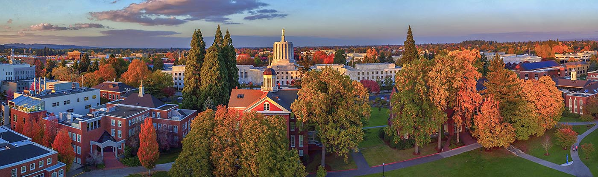

::: {.banner-image}

:::

## Abstract

Willamette University's Admissions Office and enrollment management team
invest significant resources in recruiting prospective students, yet a
meaningful portion of admitted applicants ultimately choose to enroll
elsewhere. To better allocate resources, we analyzed past enrollment data
using Multiple Linear Regression and XGBoost to identify which applicant
characteristics predict the type of school a student will enroll in. We
found that an applicant's region of origin has the most impact on where
they enroll, along with their academic strength and financial situation.
Enrollment at Northwest 5 schools specifically is also greatly influenced by
campus visitation and legacy status. These findings are limited by the
relatively small sample size and time window of available data, which
limits generalizability to other institutions. With these findings, the
Willamette Admissions and Enrollment teams can better focus their time and
resources on recruiting new students.

## The Problem

Every year, Willamette University's Admissions Office works hard to recruit
a strong incoming class — but a meaningful share of admitted students end up
enrolling somewhere else. Right now, the office doesn't have a good,
data-driven way to tell, at the point of application, where a student who
isn't coming to Willamette is likely to go instead. That makes it hard to
tailor outreach — the message that might change a student's mind about a
small private college in Oregon is very different from the message that
might matter to a student choosing a big public university.

This project builds a model that looks at an applicant's profile — things
like where they're from, their academic record, and their financial
situation — and predicts which *type* of school they're most likely to
choose if not Willamette: another small private Northwest college, a large
public university, or a local public or private school closer to home.

**Research Questions:**

1. What applicant characteristics most strongly predict whether an admitted
   student will enroll at a private Northwest institution or a large public
   university?
2. Are there additional meaningful enrollment destinations beyond the
   initial categories that arise from the data, and what applicant profiles
   define those groups?

## Impact & Stakeholders

**Primary stakeholders.** The primary beneficiaries of this project are
William Mullen, VP for Enrollment Management, and the broader Admissions
team at Willamette University. A well-performing model gives the Admissions
office a practical tool for more efficient recruitment and outreach, with
the potential to improve yield rates over time.

**Indirect stakeholders.** Willamette's Marketing team stands to benefit as
well, since the model's insights could inform messaging and campaign
strategy. Prospective students may also benefit from outreach that is more
relevant to their situation and interests.

**Organizational impact.** A reliable prediction model gives the Admissions
office a replicable, data-informed process that can be refined each
recruitment cycle and used to guide yield strategy. Over time, even modest
improvements in enrollment rate can carry meaningful financial and
institutional implications for the university.

---

Explore the project using the links above:

::: {.button-row}
[Data](data.qmd){.btn .btn-primary role="button"}
[Analysis](analysis.qmd){.btn .btn-primary role="button"}
[Findings](findings.qmd){.btn .btn-primary role="button"}
:::

All of our code is available in our public GitHub repository:
[Capstone2026-Applicant-Trajectory](https://github.com/Data-Science-Capstone-Project-2026/Public_Repository).
(Note: the underlying applicant data is confidential and is not included in
the repo.)

*DATA 510 Capstone Project · Willamette University · Summer 2026*